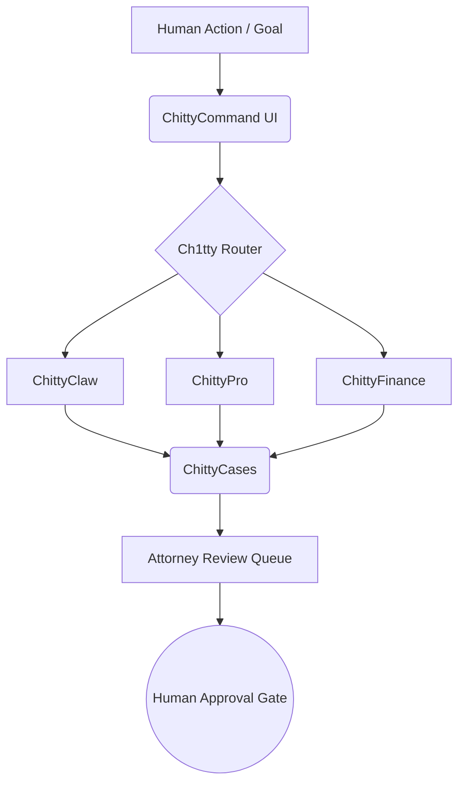

# ChittyCommand v2: Principled Refactor Spec

## 1. Product Concept
ChittyCommand v2 shifts from being a "better dashboard" or standalone application into the **canonical orchestration cockpit for ChittyOS**. It is the shell through which the user interacts with the entire suite of distributed truth-producing engines. 

ChittyCommand **does not own truth**. It is a visualization, routing, and orchestration layer. It exposes the litigation, life, and asset command modes, acting as the unified interface where the Ch1tty pilot layer, the ChittyClaw legal brain, and the underlying bedrock services converge to empower human decision-making.

## 2. Canonical Service Responsibility Matrix
The engines generate truth; the cockpit visualizes it.

| Domain | Owning Engine | Cockpit Role (ChittyCommand) |
| :--- | :--- | :--- |
| **Matters & Strategy** | `ChittyCases` / `ChittyClaw` | Visualizes matter posture, synthesizes legal elements, queues strategy |
| **Evidence & Facts** | `ChittyEvidence` / `ChittyStorage` | Reconstructs timeline, maps source files, highlights audit gaps |
| **Proof & Discovery** | `ChittyProof` / `ChittyPro` | Displays contradiction hotspots, assembles proof packets, gates readiness |
| **Finance & Runway** | `ChittyFinance` | Projects cashflow, stages damages, monitors burn rate |
| **Assets & Value** | `ChittyAssets` | Surfaces valuations, tracks encumbrances, maps entities |
| **Immutable Truth** | `ChittyLedger` | Reads chronological event custody and DRL (Reputation) reckoning |
| **Orchestration** | `Ch1tty` | Routes intents, launches workflows, handles agent handoffs |

## 3. Refactored Navigation
Navigation moves away from generic views to highly opinionated, purpose-driven **Command Modes**.

*   **[Default] Case Command**: Litigation + Life Operations Cockpit
*   **Evidence Command**: Timeline reconstruction and gap analysis
*   **Finance Command**: Damages staging and runway protection
*   **Asset Command**: Entity map and encumbrance tracking
*   **Proof Command**: Citation completeness and packet assembly
*   **Contradiction Command**: ChittyPro conflict detection and impeachment logic
*   **Life Ops Command**: Daily non-litigation operations
*   **Ch1tty Orchestration Command**: Agent routing, workflow supervision
*   **Export / Filing Command**: Court-ready document sequencing
*   **System Health Command**: Ecosystem readiness and canonical compliance

## 4. Data Ownership Map
To prevent ChittyCommand from becoming a shadow source of truth, all data flows adhere strictly to canonical pipelines:

*   **Source-gated data:** `ChittyStorage` → `ChittyEvidence` → `ChittyProof` → `ChittyLedger` → `ChittyCases`
*   **Financial data:** `ChittyFinance` → `ChittyLedger` → `ChittyCases`
*   **Asset/Value data:** `ChittyAssets` → `ChittyFinance` → `ChittyCases`
*   **Contradictions:** `ChittyEvidence` + `ChittyContextual` → `ChittyPro Contradiction Engine` → `ChittyCases`
*   **Legal Strategy:** `ChittyClaw` → `ChittyCases` → **Attorney Review Queue**

## 5. Workflow Orchestration Map
Ch1tty serves as the pilot layer. Workflows are launched from ChittyCommand, executed by Ch1tty, processed by the bedrock services, and returned to ChittyCommand for approval.

## 6. UI Component Plan
Every card, timeline item, task, and recommendation must be a strict projection of the bedrock. They must explicitly declare their provenance.

**Standardized Component Anatomy:**
*   **Visual Data:** The projection of the data (e.g., a timeline event).
*   **Metadata Ribbon (Bottom/Side):**
    *   `Owning Service`: (e.g., `ChittyEvidence`)
    *   `Source Table`: (e.g., `ev_facts`)
    *   `Canonical ID`: (e.g., `FCT-9A2B`)
*   **State Indicators (Top Right):**
    *   `Readiness Status`: (e.g., `Sourced`, `Unverified`)
    *   `Blocker State`: (e.g., `Awaiting Deposition`)
*   **Action Row:**
    *   `Next Action`: Auto-computed by ChittyClaw
    *   `Approval Gate`: Explicit human/attorney sign-off button

## 7. Readiness Scoring Model
Readiness is computed, not asserted. 
*   **Fact Readiness:** (Sourced + Hashed in Ledger) = 1.0
*   **Element Readiness:** (All required facts for a legal element reach 1.0) = Ready
*   **Filing Readiness:** (All elements Ready + Attorney Approval Gate cleared) = Ready for Export

## 8. Evidence Governance Rules
*   **No Raw Storage:** ChittyCommand cannot accept file uploads directly to its own DB. It must use the `ChittyStorage` canonical pipeline.
*   **No Unattributed Facts:** A fact without a valid `canonical ID` pointing to `ChittyEvidence` renders with a red `[UNSOURCED]` warning and prevents filing export.
*   **Immutability:** ChittyCommand cannot edit a ledger event. It can only dispatch a workflow to append a correction to `ChittyLedger`.

## 9. Context-Aware Matter Implementation (Example: Arias v. Bianchi)
ChittyCommand dynamically configures its default mode based on the active matter injected by `ChittyContextual`. It does not hardcode cases. 

**Example Homepage layout for an active litigation matter (e.g., Arias v. Bianchi):**
1.  **Ch1tty Command Bar:** Global intent routing.
2.  **Case Readiness Thermometers:** Visualizing elements of the claim (e.g., Breach of Fiduciary Duty, Fraud).
3.  **Strategic Objective Cards:** Sourced from `ChittyContextual` / `ChittyCases` for this specific matter.
4.  **Evidence Reconstruction Timeline:** Intersecting `ChittyFinance` anomalies with `ChittyEvidence` emails.
5.  **Strategy Execution Timeline:** Forward-looking roadmap.
6.  **Filing Sequencer:** Document assembly for the next court deadline.
7.  **Attorney Decision Queue:** Items requiring explicit human approval.
8.  **Financial Runway:** Current cash flow vs projected litigation costs.
9.  **Contradiction Hotspots:** Highlighting where counterparty statements conflict with `ChittyPro`.
10. **Ecosystem Health Rail:** (Governance is shifted here, not the homepage).

## 10. Migration Plan from Current ChittyCommand
1.  **Audit:** Map all current ChittyCommand local states to their canonical bedrock owners.
2.  **Strip:** Remove all truth-owning database tables from ChittyCommand.
3.  **Rewire:** Rebuild data fetching to query `ChittyCases`, `ChittyFinance`, etc.
4.  **Componentize:** Implement the Standardized Component Anatomy for all UI elements.
5.  **Launch:** Default the router to Case Command.

## 11. CHARTER.md Update Proposal
**Add to Core Principles:**
> "ChittyCommand is the cockpit, not the engine. It shall never act as a source of truth for facts, finances, assets, or legal conclusions. Its sole mandate is to visualize, route, and orchestrate the truth produced by the canonical ChittyOS ecosystem."

## 12. CHITTY.md Update Proposal
**Add to Architecture Constraints:**
> "All ChittyCommand UI components must explicitly render their canonical provenance, including the Owning Service, Source Table, and Canonical ID. Any data mutation must be routed through the Ch1tty pilot layer to the appropriate bedrock service."

## 13. AGENTS.md Update Proposal
**Add to Agent Routing Rules:**
> "Agents interfacing with ChittyCommand must respect the Attorney Decision Queue. Agents may assemble packets, detect contradictions (ChittyPro), and propose strategies (ChittyClaw), but cannot bypass the human approval gate for filings, strategy shifts, or irreversible ecosystem mutations."

## 14. Open Questions / Integration Blockers
*   **Latency:** Does rendering the Standardized Component Anatomy across hundreds of timeline events introduce query bloat? (Requires aggressive caching and materialized views in the bedrock).
*   **Authentication:** How does ChittyAuth map user roles to the "Attorney Review Queue"?
*   **Contextual Sync:** Ensuring `ChittyContextual` accurately maintains the "active context" as the user switches between Command Modes.
